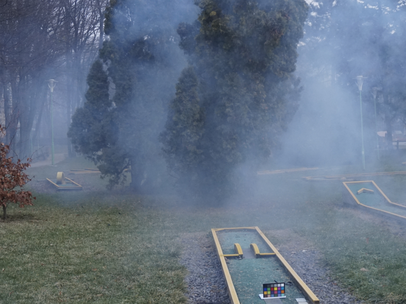
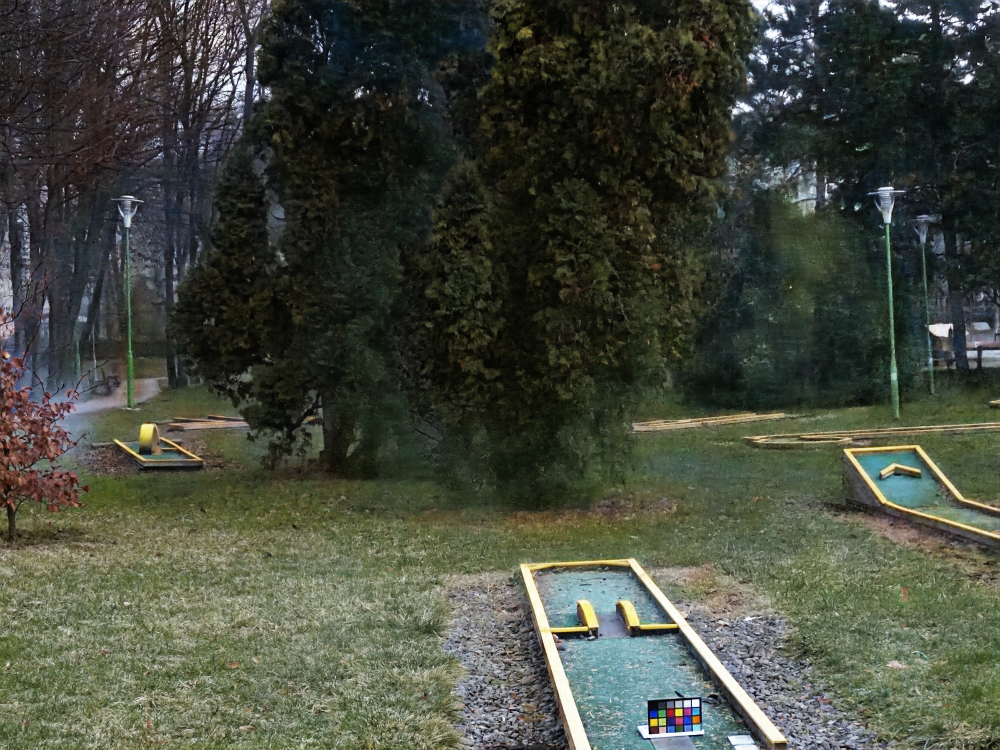
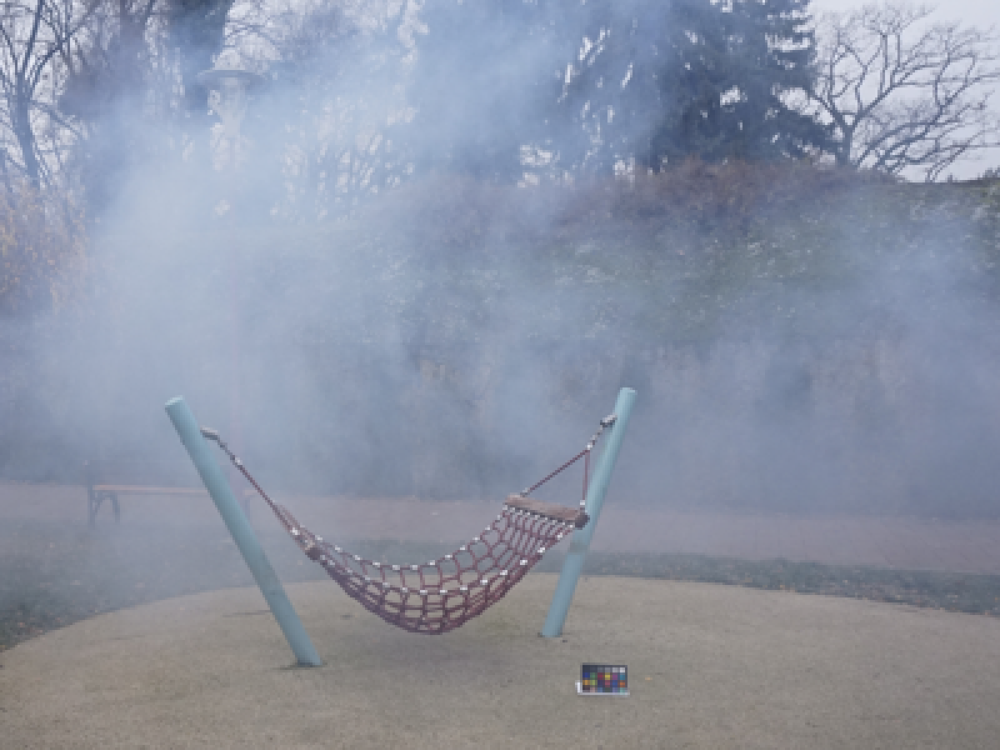
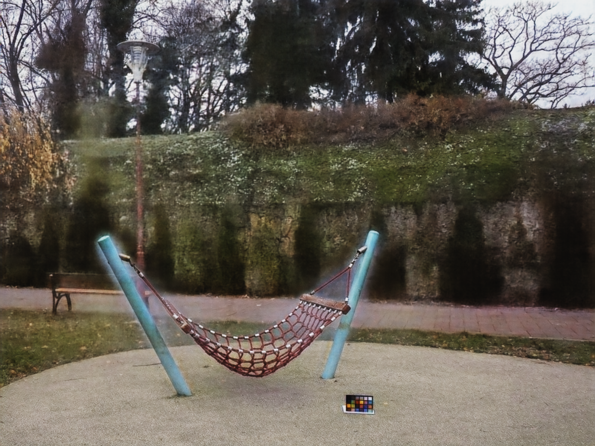
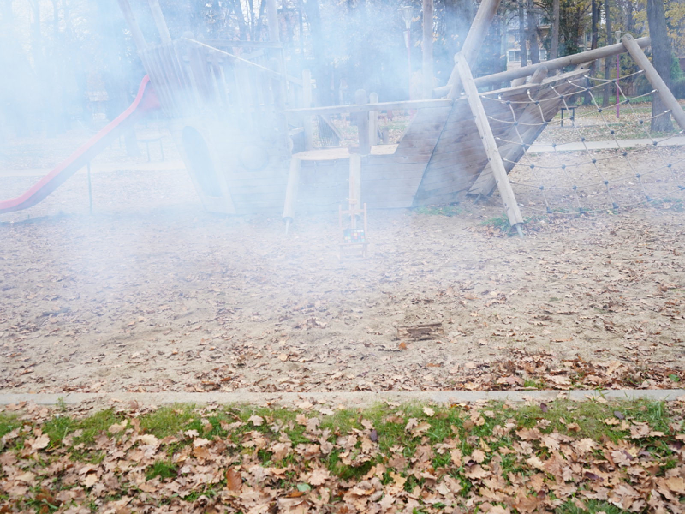
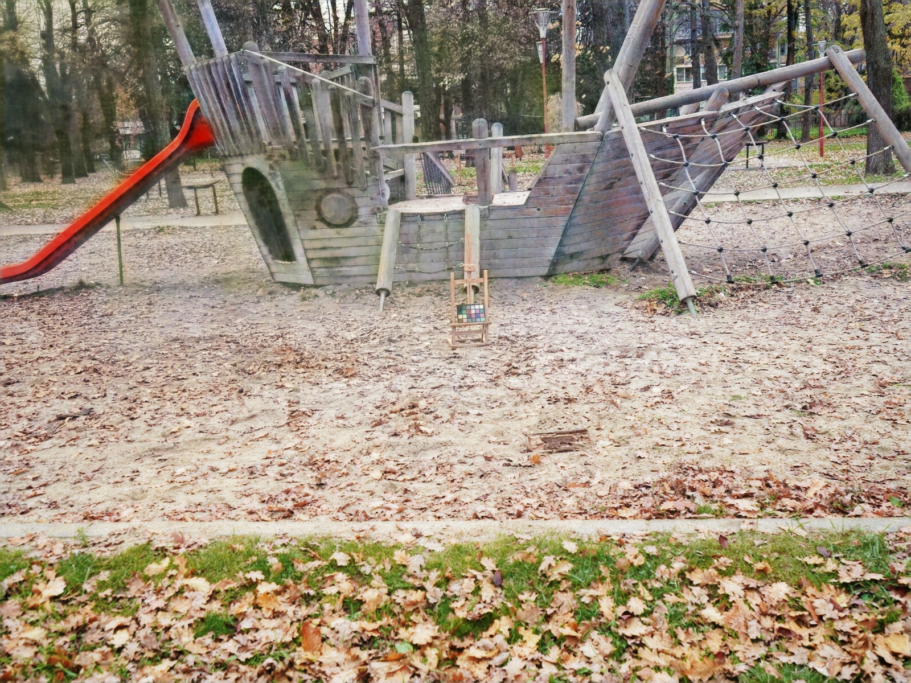
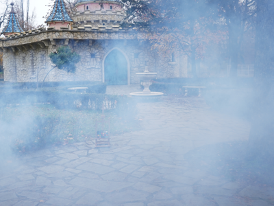
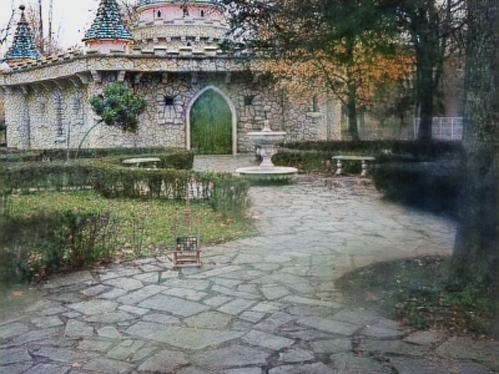

# EARHD

## 《Non-homogeneous Image Dehazing with Edge Attention Based on Relative Haze Density》
> **Abstract**. Image dehazing is a widely used technology for recovering clear images from hazy inputs. However, most dehazing methods are designed to target a specific haze concentration, without considering the varying degrees of image degradation. Removing non-homogeneous haze from real-world images is challenging. To address this issue, this study proposes a dual-cycle framework based on relative haze density, in which inputs are regarded as both hazy images to be recovered by a restoration network (RNet) and clear images to be deteriorated by a degradation network (DNet). Edge attention blocks and multi-order derivative loss are proposed for RNet to enhance the details and colors. Furthermore, two multi-class discriminators are designed to distinguish between relative levels of haze density. Extensive experiments on both real-world and synthetic datasets demonstrate that the proposed method is superior to state-of-the-art approaches for non-homogeneous image dehazing using either supervised or unsupervised learning. This code is available at https://github.com/lizhangray/EARHD.

## Environment
All environment configurations are provided in the "sym.yaml" file. Please refer to this file for setting up your environment.

Create and activate a new environment using the sym.yaml file:

```bash
conda env create -f sym.yaml
conda activate <environment_name>
```
Replace <environment_name> with the name specified in the sym.yaml file.

## Checkpoints & Datasets
### Res2Net Pretrain Model
[[**BaiduNetdisk**](https://pan.baidu.com/s/1oKP8rkaz-czr66y9RA5xTQ?pwd=LizG)] 

### NHHAZE2020 Model
This is a PTH file trained on the NHHAZE2020 dataset. Below is the download link from Baidu Netdisk and instructions for use.
[[**BaiduNetdisk**](https://pan.baidu.com/s/1rbp0kdnekrekx3-ViQyAOA?pwd=LizG)] 

### Datasets
You can download the NTIRE dataset from the following link:
[[**NTIRE**](https://pan.baidu.com/s/1SUUBMcfKgqn1QZpKOrvNgA?pwd=851n )] 


### Directory Structure
Here is a simple diagram illustrating the directory structure:
```bash
project_root/
├── input/
├── weights/
│   └── res2net.pth
├── output/
│   └── bestpsnr.pth
├── sym.yaml
└── option.py
```


## Run

```shell

# test
python main.py
```


## Example
#### NHHAZE20 Image with 2x Downsampling
<div align=center>
<center class="half">
    
</center>
</div>

#### NHHAZE20 Image with 4x Downsampling
<div align=center>
<center class="half">
    
</center>
</div>

#### NHHAZE21 Image with 2x Downsampling
<div align=center>
<center class="half">
    
</center>
</div>

#### NHHAZE21 Image with 4x Downsampling
<div align=center>
<center class="half">
    
</center>
</div>


## Citation

Please cite this paper in your publications if it is helpful for your tasks.

Deng, R. et al. (2024). Non-homogeneous Image Dehazing with Edge Attention Based on Relative Haze Density. In: Huang, DS., Zhang, C., Zhang, Q. (eds) Advanced Intelligent Computing Technology and Applications. ICIC 2024. Lecture Notes in Computer Science, vol 14868. Springer, Singapore. https://doi.org/10.1007/978-981-97-5600-1_2

```tex
@InProceedings{deng2024nonhomogeneous,
    author    = {Deng, Ruting and Li, Zhan and Deng, Yifan and Long, Hang and Chen, Zhanglu and Kang, Zhiqing and Qiu, Zhichao},
    title     = {Non-homogeneous Image Dehazing with Edge Attention Based on Relative Haze Density},
    booktitle = {Proceedings of the International Conference on Intelligent Computing (ICIC)},
    year      = {2024},
    pages     = {15--28},
    publisher = {Springer},
}

```

